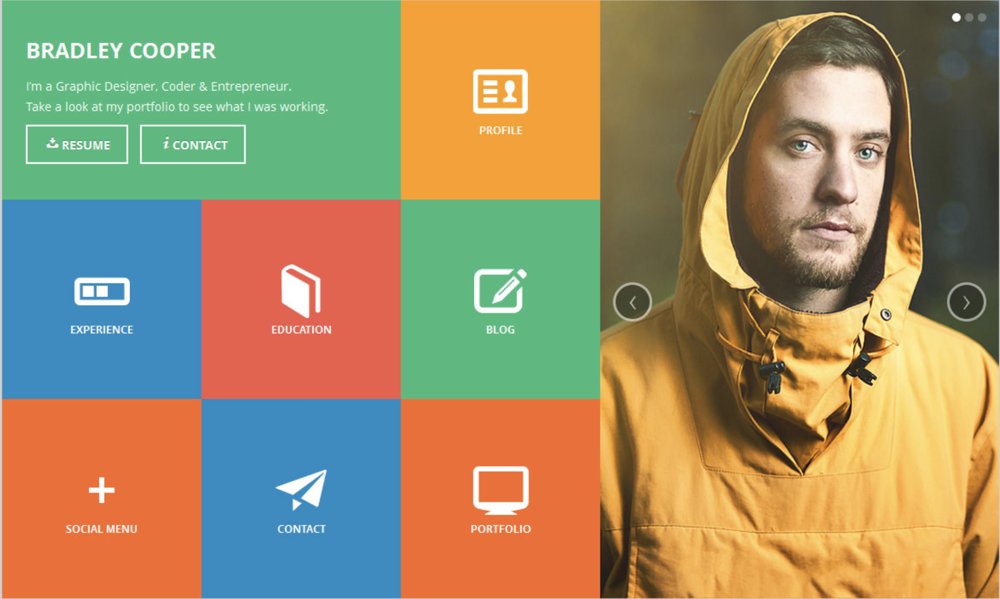
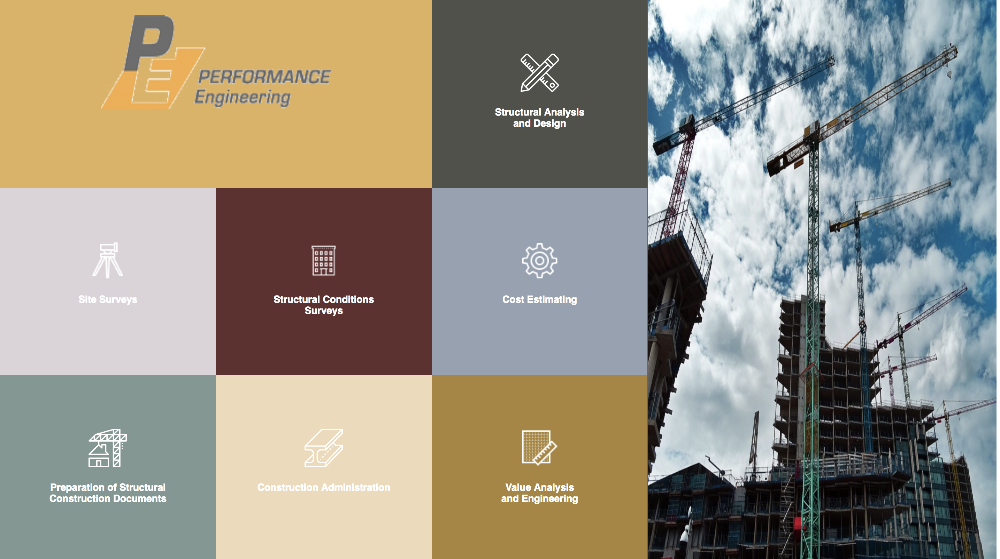

In this project we were to mimic the HTML and CSS of Bradley Cooper's personal page.  I used some basic information from an engineering firm to recreate the project.  We were to make the page responsive and able to resize to fit an iphone5 screen. During the process, I acheved some sucess, but had a hard time positioning each box's contents.  I eventually overcame this challenge, however this left me in a situation where I was unable to give necessary attention to a handful of other key points. I was able to make the phone screen resond nicely, but was not able to insert and additional transition screen.

